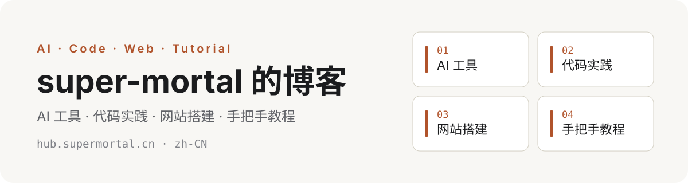

<p align="center">
  
</p>

# super-mortal 的博客

你好，我是 **super-mortal** —— 一名以实战驱动的全栈开发者 / AI Agent 实践者，来自广东湛江，现于广州求学。喜欢不断学习新东西，学了就上手实践，再把收获沉淀成自己的知识体系，写成文章记录下来，也希望能帮到别人。

**这个仓库就是我的博客**（[hub.supermortal.cn](https://hub.supermortal.cn)），一个只写「我真正做过的事」的地方：每一篇文章背后都有一次真实的实践——踩过的坑、跑通的方案、验证过的结论。

## 这里写什么

| 板块 | 内容 | 代表性话题 |
| --- | --- | --- |
| 🤖 **AI 工具** | AI 产品的真实上手与评测，只说用过的 | AI Agent、MCP 工具生态、大模型编程、知识库应用 |
| 💻 **代码实践** | 从想法到可运行项目的完整过程 | Node.js / Vue 全栈开发，项目沉淀为开源仓库 |
| 🌐 **网站搭建** | 从零把一个站点搬到线上 | VPS 基础设施、域名解析、部署与 HTTPS、系统稳定性与可观测性 |
| 📖 **手把手教程** | 照着做就能成的分步指南 | 每一步都有命令与截图，结论可复现 |

> 文章偏实用，也保留个人判断。—— 不追热点通稿，没做过的不写。

## 去哪里读

- 🏠 **主站**：[hub.supermortal.cn](https://hub.supermortal.cn) —— 所有文章与随笔
- 📚 **个人主站**：[supermortal.cn](https://supermortal.cn) —— 关于我、以及更多项目
- 📡 **RSS 订阅**：[hub.supermortal.cn/rss.xml](https://hub.supermortal.cn/rss.xml)
- 💬 **评论区**：文章底部可留言，支持选中正文一键引用讨论
- 🔍 **AI 友好**：站点提供 `llms.txt`，欢迎 AI 助手检索与引用

## 关于这个仓库

博客基于 Astro 构建，内容全部用 Markdown 管理，构建时生成纯静态页面。仓库开放，如果你喜欢这里的文章，也想搭一个一样的，直接 Fork 去用：

- **技术栈**：Astro 7 + 原生 Markdown，无前端框架依赖
- **内置能力**：文章 / 随笔 / 归档 / 分类 / 标签 / 全文搜索 / RSS / sitemap / `llms.txt` / 评论（Twikoo 2.x，可选）
- **快速开始**：

```bash
git clone https://github.com/super-mortal/mortalhub.git
cd mortalhub
npm install
npm run dev   # http://localhost:26102
```

## 找到我

[GitHub](https://github.com/super-mortal) · [Bilibili](https://space.bilibili.com/2090094430) · [X（推特）](https://x.com/mortal__hub)

---

License 见 [LICENSE](LICENSE)。
